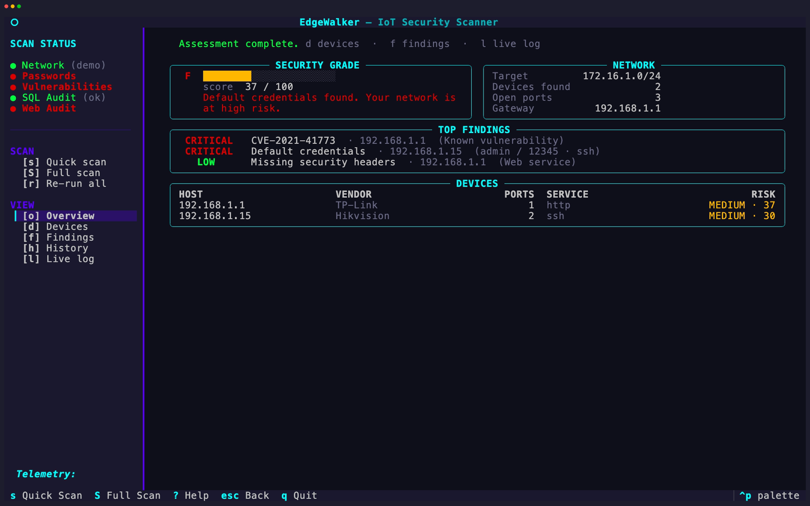

<h1 align="center">EdgeWalker - Assisting in securing your network</h1>

<p align="center">
  
  <br>
  <em>EdgeWalker is a high-performance IoT security scanner that audits your home network for open ports, default credentials, and known vulnerabilities. Developed by <a href="https://periphery.security">periphery</a>), it empowers users to verify the security claims of their smart devices rather than relying on marketing labels.</em>
  <br>
</p>

<p align="center">
  <a href="https://periphery.security/"><strong>periphery.security</strong></a>
  <br>
</p>

<p align="center">
  <a href="CONTRIBUTING.md">Contributing Guidelines</a>
  ·
  <a href="https://github.com/periphery-security/edgewalker/issues">Submit an Issue</a>
  <br>
  <br>
</p>


[](https://www.python.org/downloads/)

<hr>

<table align="center">
  <tr>
    <td align="center"><strong>EdgeWalker Demo</strong></td>
    <td align="center"><strong>Scan Report</strong></td>
  </tr>
  <tr>
    <td></td>
    <td></td>
  </tr>
</table>

---

## Key Features

| Feature | Description | How it Works |
| :--- | :--- | :--- |
| **Port Scan** | Identifies open ports and active services. | `nmap` wrapper with parallel batch scanning. |
| **Credential Test** | Checks for default/weak passwords (SSH, FTP, Telnet, SMB). | Bundled database of ~430 common IoT credentials. |
| **CVE Check** | Matches detected software against known vulnerabilities. | Real-time NVD API lookup. |
| **Risk Scoring** | Provides an actionable security grade (A-F). | Proprietary scoring engine (0-100). |

---

## Installation

### One-Line Installer
```bash
curl -sSL https://raw.githubusercontent.com/periphery-security/edgewalker/main/scripts/install.sh | sudo bash
```

### Manual Installation (via pipx)
<!--
```bash
pipx install edgewalker
```
-->

```bash
pipx install git++https://github.com/periphery-security/edgewalker.git
```


The installer verifies Python 3.13+, installs `nmap` if missing, and configures `edgeWalker` as a global CLI command.

NOTE: We are currently awaiting approval of the package on pypi.org to allow `edgeWalker` to be installed via pipx as a package.

---

## Quick Start

### Interactive Mode (TUI)
```bash
edgewalker
```
> **Note:** On macOS, use `sudo edgewalker`. On Linux, the installer configures `nmap` capabilities, removing the need for `sudo`.

### CLI Mode
```bash
edgewalker scan                    # Quick port scan (~30s)
edgewalker scan --full             # Full 65,535 port scan
edgewalker scan --target 10.0.0.1  # Scan a single device
edgewalker creds                   # Test default credentials
edgewalker cve                     # Check for known CVEs
edgewalker report                  # View security report
```

### CI/CD & Automation
EdgeWalker supports non-interactive execution for automated environments:
```bash
# Run a silent scan with explicit telemetry opt-in
edgewalker --silent --accept-telemetry scan --target 192.168.1.0/24
```
See the [Configuration Guide](docs/configuration.md#non-interactive-silent-mode) for more details.

---

## The Periphery Mission

We frequently encounter vendors who promise "secure by design" devices. We don't buy it. EdgeWalker began at **Periphery's 2025 Hackathon**, built in 48 hours by Dr Lina Anaya, Travis Pell, Steven Marks, and Adam Massey. It represents our commitment to transparency and evidence-based security in the IoT era.

---

## Contributing

### Contributing Guidelines

Read through our [contributing guidelines](CONTRIBUTING.md) to learn about our submission process, coding rules, and more.

### Want to help?

Want to report a bug, contribute some code, or improve the documentation? Excellent! Read our guidelines for [contributing](CONTRIBUTING.md) and then check out one of our issues labeled as `help wanted` or `good first issue`.

### Code of Conduct
Help us keep Edgewalker open and inclusive. Please read and follow our [Code of Conduct](CODE_OF_CONDUCT.md).

---

## Legal Disclaimer

**EdgeWalker is for authorized security testing only.** Use this tool only on networks and devices you own or have explicit permission to scan. Unauthorized scanning of third-party networks may be illegal. Periphery and the EdgeWalker contributors assume no liability for misuse of this tool.

---

## Support the Project

If EdgeWalker helps you secure your home, please give us a **Star on GitHub**! It helps others find the project and keeps us motivated to build more.

---

## License

Distributed under the MIT License. See [LICENSE](LICENSE.md) for more information.
